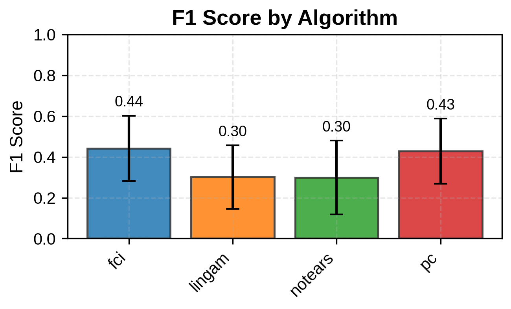
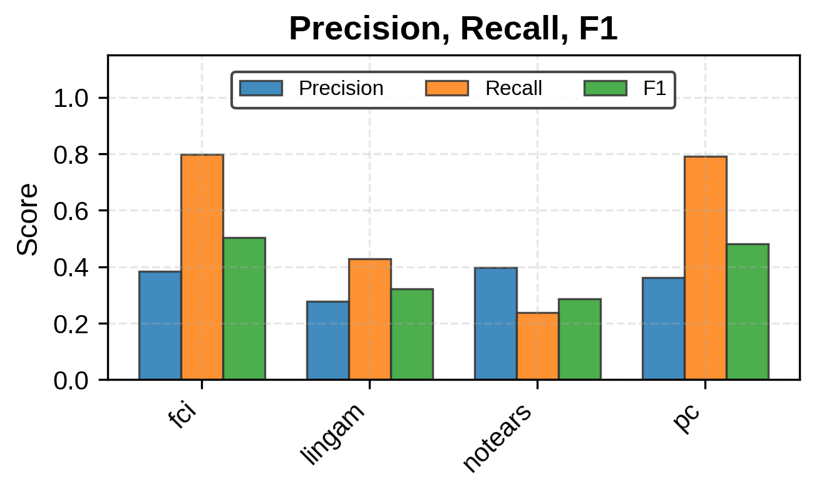
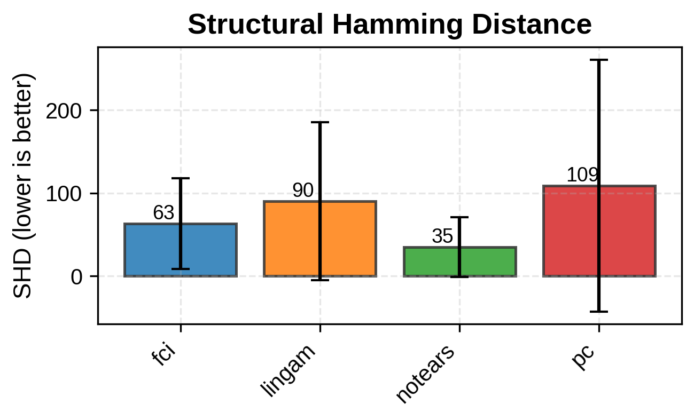
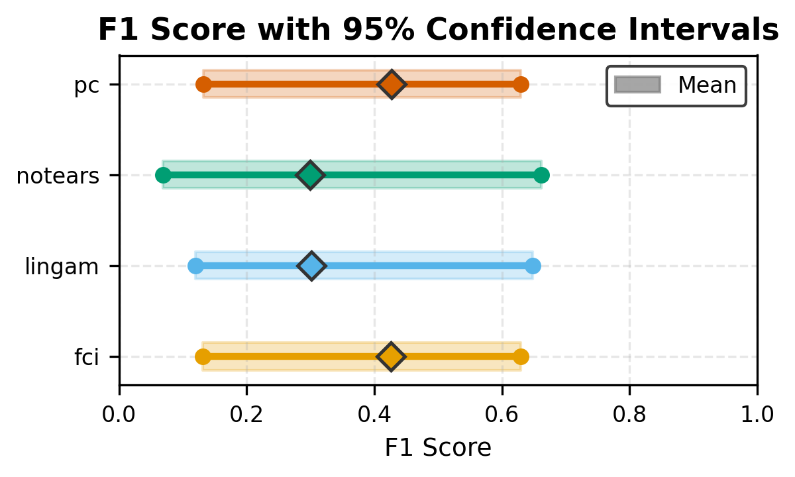
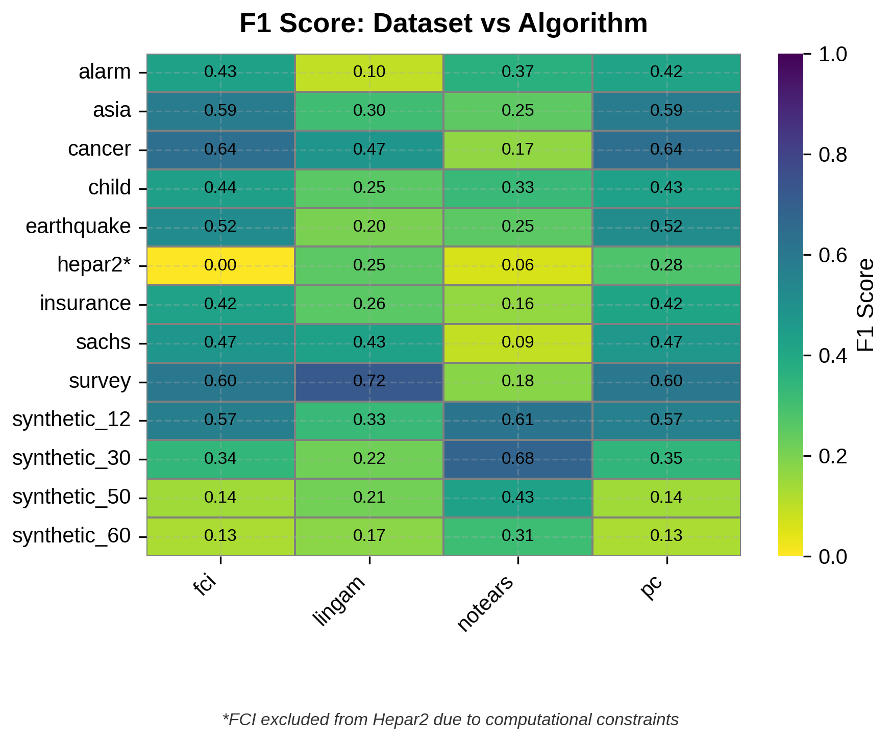
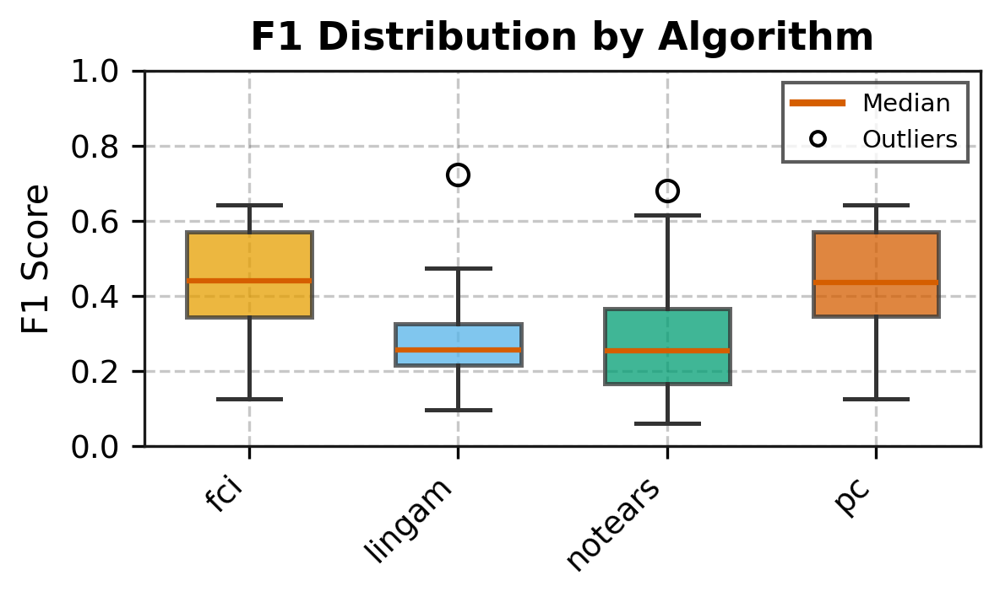
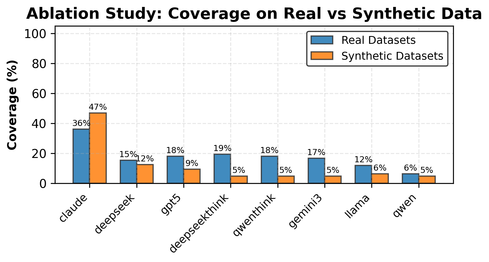
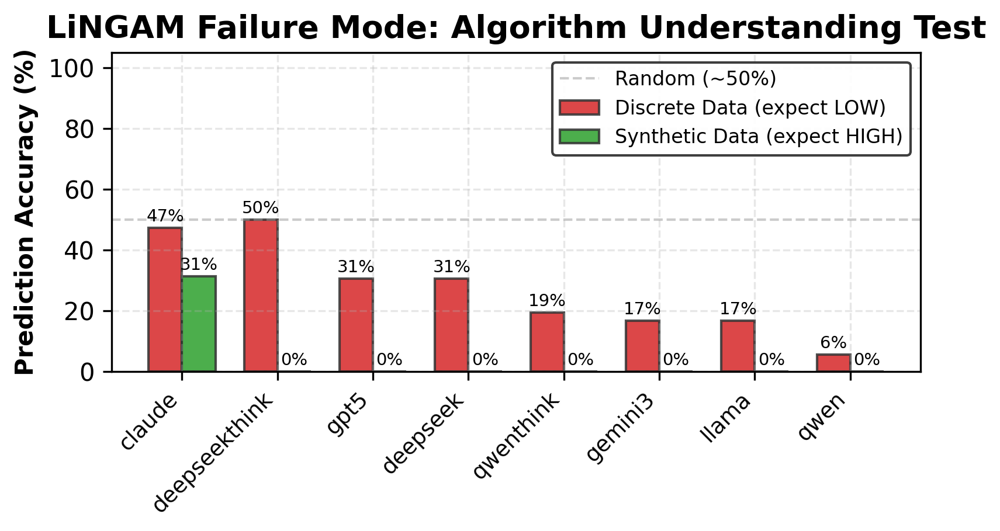
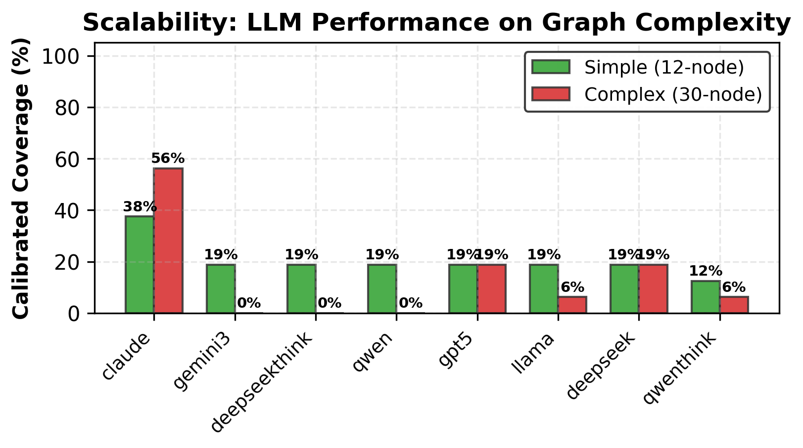
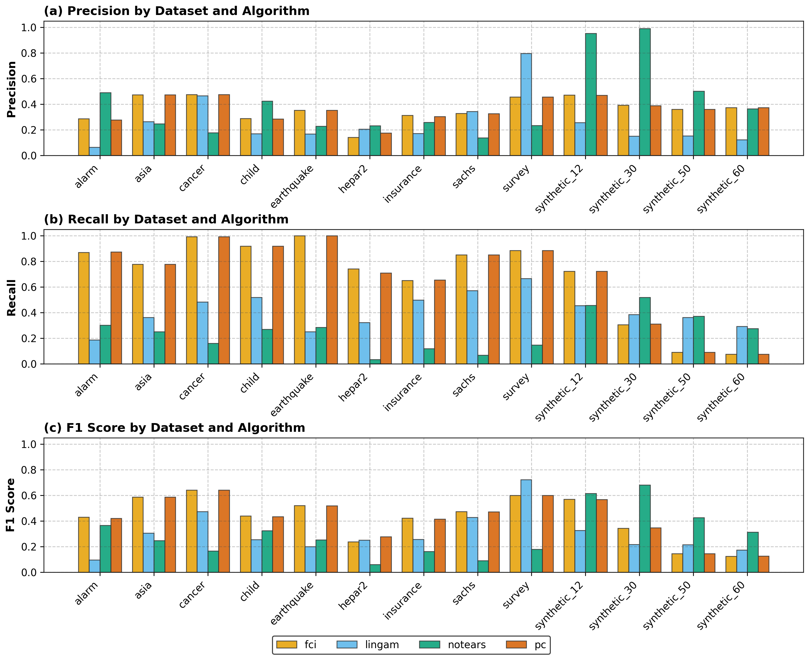

# Large Language Models Are Algorithmically Blind

Can LLMs predict how causal discovery algorithms actually perform? We test 8 frontier LLMs across 13 datasets and 4 algorithms, comparing their predicted performance ranges against ground truth from 5,200 algorithm runs. Result: **84.1% of LLM predictions fail to contain the true algorithmic performance** -- even with ranges 8-27x wider than actual confidence intervals.

## Key Finding

**Calibrated Coverage = 15.9%** (264/1,664 comparisons)

LLMs are asked to predict metric ranges (precision, recall, F1, SHD) for causal discovery algorithms on specific datasets. The LLM's predicted range contains the true algorithmic mean only 15.9% of the time.

| Model | Model ID | Calibrated Coverage | Comparisons |
|-------|----------|-------------------:|------------:|
| Claude | `Claude-Opus-4.6` | 39.4% | 82/208 |
| GPT-5 | `GPT-5.2` | 15.4% | 32/208 |
| DeepSeek-Think | `DeepSeek-V3.2-Reasoner` | 14.9% | 31/208 |
| DeepSeek | `DeepSeek-R1-0528` | 14.4% | 30/208 |
| Qwen-Think | `Qwen3-Next-80B-A3B-Thinking` | 13.9% | 29/208 |
| Gemini 3 | `Gemini3-Pro-Preview` | 13.0% | 27/208 |
| LLaMA | `LLaMA-3.3-70B` | 10.1% | 21/208 |
| Qwen | `Qwen2.5-7B` | 5.8% | 12/208 |

## Evidence for Memorization over Reasoning

Coverage on benchmark networks (known in literature) vs synthetic networks (never in training data):

| Dataset Type | Coverage | Comparisons |
|-------------|--------:|-----------:|
| Benchmark (9 datasets) | 17.7% | 204/1,152 |
| Synthetic (4 datasets) | 11.7% | 60/512 |

Coverage collapses further as network size increases:

| Synthetic Network | Nodes | Coverage |
|------------------|------:|---------:|
| Synthetic-12 | 12 | 20.3% |
| Synthetic-30 | 30 | 13.3% |
| Synthetic-50 | 50 | 7.0% |
| Synthetic-60 | 60 | 6.2% |

## Algorithmic Ground Truth

Each algorithm was run 100 times per dataset to establish stable 95% confidence intervals.

| Algorithm | Mean F1 | Datasets | Best On |
|-----------|--------:|---------:|---------|
| FCI | 0.426 | 13 | Asia, Cancer, Earthquake, Child |
| PC | 0.427 | 13 | Asia, Cancer, Earthquake, Child |
| LiNGAM | 0.301 | 13 | Survey (0.724) |
| NOTEARS | 0.299 | 13 | Synthetic-30 (0.681), Synthetic-12 (0.615) |

### Coverage by Algorithm

| Algorithm | Coverage |
|-----------|--------:|
| NOTEARS | 20.7% |
| LiNGAM | 20.0% |
| PC | 11.5% |
| FCI | 11.3% |

### Coverage by Dataset

| Dataset | Type | Coverage |
|---------|------|--------:|
| Asia | Benchmark | 23.4% |
| Cancer | Benchmark | 21.9% |
| Synthetic-12 | Synthetic | 20.3% |
| Alarm | Benchmark | 18.8% |
| Insurance | Benchmark | 18.8% |
| Survey | Benchmark | 18.0% |
| Child | Benchmark | 17.2% |
| Sachs | Benchmark | 16.4% |
| Earthquake | Benchmark | 14.1% |
| Synthetic-30 | Synthetic | 13.3% |
| Hepar2 | Benchmark | 10.9% |
| Synthetic-50 | Synthetic | 7.0% |
| Synthetic-60 | Synthetic | 6.2% |

### Coverage by Metric

| Metric | Coverage |
|--------|--------:|
| Recall | 18.8% |
| F1 | 16.3% |
| SHD | 14.9% |
| Precision | 13.5% |

## Project Structure

```
confidence-crisis/
├── prompts/
│   └── prompt_templates.py          # 3 prompt formulations (direct, step-by-step, meta-knowledge)
├── src/
│   ├── experiments/
│   │   ├── run_experiments.py       # Phase 1: Run algorithms 100x each (ground truth)
│   │   ├── analyze_results.py       # Generate algorithmic performance plots
│   │   └── results/                 # 52 variance JSON files + plots
│   ├── llm/
│   │   ├── query_all_llms.py        # Phase 2: Query 8 LLMs (1,248 API calls)
│   │   ├── extract_llm_ranges.py    # Phase 3: Parse LLM responses into ranges
│   │   ├── aggregate_formulations.py # Phase 4: Average across 3 formulations
│   │   ├── compare_llm_vs_algorithmic.py # Phase 5: Compute calibrated coverage
│   │   ├── plot_llm_results.py      # Generate LLM analysis plots
│   │   ├── compute_prompt_robustness.py  # Prompt sensitivity analysis
│   │   ├── cross_algorithm_analysis.py   # Cross-algorithm blindness analysis
│   │   └── results/                 # Extracted ranges, aggregated ranges, comparisons
│   ├── baselines/
│   │   ├── simple_baselines.py      # Random & heuristic baseline predictors
│   │   └── compare_baselines_full.py # Compare LLMs against baselines
│   └── evaluation/
│       ├── metrics.py               # Calibrated coverage metric implementation
│       ├── compute_metrics.py       # Batch metric computation
│       └── generate_tables.py       # LaTeX table generation
├── METHODOLOGY.md                   # Full pipeline documentation
└── README.md
```

## Reproducing the Experiments

### Prerequisites

```bash
pip install -r requirements.txt

# API keys for LLM queries
export OPENAI_API_KEY="your-key"
export ANTHROPIC_API_KEY="your-key"
export GOOGLE_API_KEY="your-key"
```

### Phase 1: Compute Algorithmic Ground Truth (~2h)

Run each algorithm 100 times per dataset to establish confidence intervals.

```bash
python src/experiments/run_experiments.py --runs 100
# Output: 52 variance files in src/experiments/results/
```

### Phase 2: Query LLMs (~3h)

Query 8 LLMs with 3 prompt formulations each across all dataset-algorithm combinations.

```bash
python src/llm/query_all_llms.py
# Output: 1,248 raw response files in src/llm/variance/raw_responses/
```

### Phase 3: Extract Ranges (~1min)

Parse LLM responses into structured metric ranges.

```bash
python src/llm/extract_llm_ranges.py
# Output: 156 extracted range files in src/llm/variance/extracted_ranges/
```

### Phase 4: Aggregate Formulations (<1s)

Average predictions across the 3 prompt formulations.

```bash
python src/llm/aggregate_formulations.py
# Output: 52 aggregated files in src/llm/variance/aggregated_ranges/
```

### Phase 5: Compare LLM vs Algorithmic (<1s)

Compute calibrated coverage and all comparison metrics.

```bash
python src/llm/compare_llm_vs_algorithmic.py
# Output: src/llm/results/comparisons/comparison_results.json
```

### Generate Plots

```bash
python src/experiments/analyze_results.py    # Algorithmic performance plots
python src/llm/plot_llm_results.py           # LLM analysis plots
```

## Figures

### Algorithmic Performance

| | |
|:---:|:---:|
|  |  |
| F1 Score by Algorithm | Precision, Recall, F1 by Algorithm |
|  |  |
| Structural Hamming Distance | F1 with 95% Confidence Intervals |
|  |  |
| F1: Dataset vs Algorithm Heatmap | F1 Distribution by Algorithm |

### LLM Algorithmic Blindness

| | |
|:---:|:---:|
|  |  |
| Calibrated Coverage by Model (Primary Result) | Benchmark vs Synthetic Coverage |
|  |  |
| LiNGAM Failure Mode Analysis | Coverage vs Network Size |

### Multi-Metric Dataset View



## Experimental Scale

| Component | Count |
|-----------|------:|
| Datasets | 13 (9 benchmark + 4 synthetic) |
| Algorithms | 4 (PC, FCI, LiNGAM, NOTEARS) |
| Algorithm runs | 5,200 (100 per dataset-algorithm) |
| LLM models | 8 |
| Prompt formulations | 3 |
| LLM API calls | 1,248 |
| Total comparisons | 1,664 |

## Methodology

The primary metric is **calibrated coverage**: does the LLM's predicted range `[lower, upper]` contain the true algorithmic mean?

```
calibrated_coverage = bool(llm_lower <= algo_mean <= llm_upper)
```

See [METHODOLOGY.md](METHODOLOGY.md) for the full 6-phase pipeline documentation.
