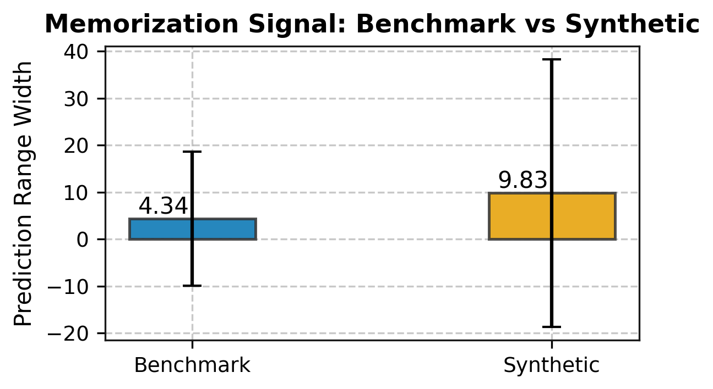
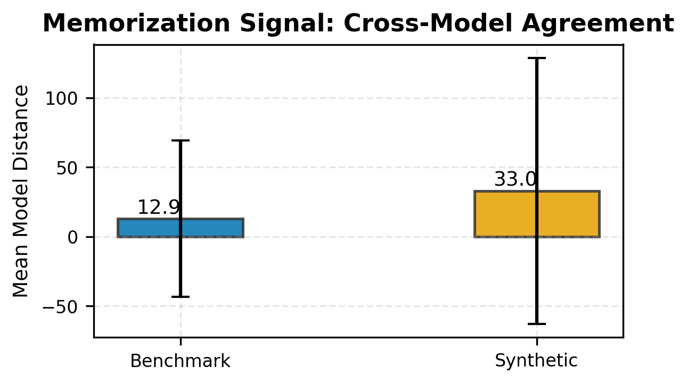
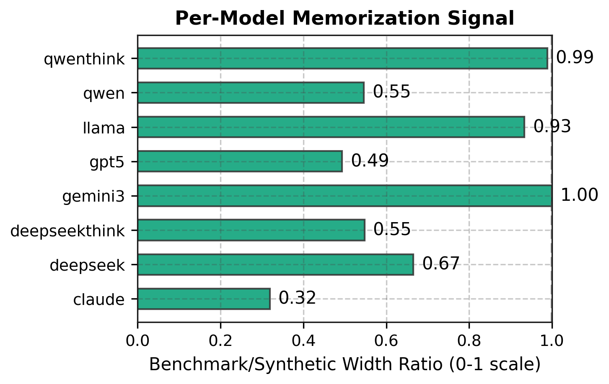
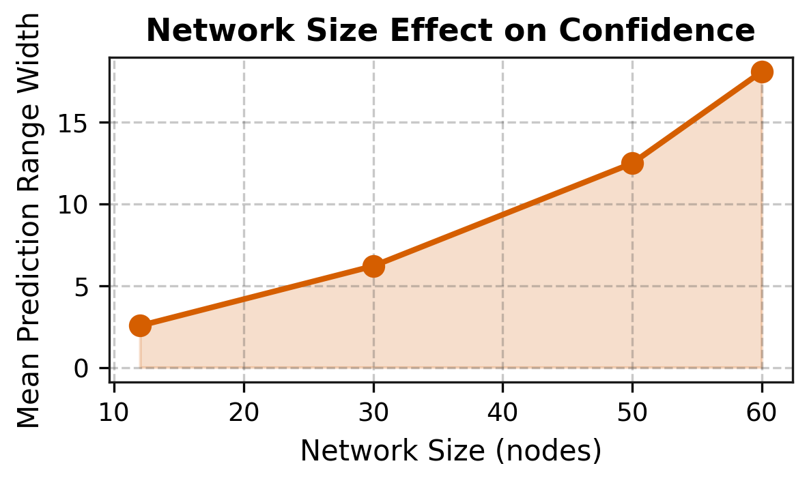
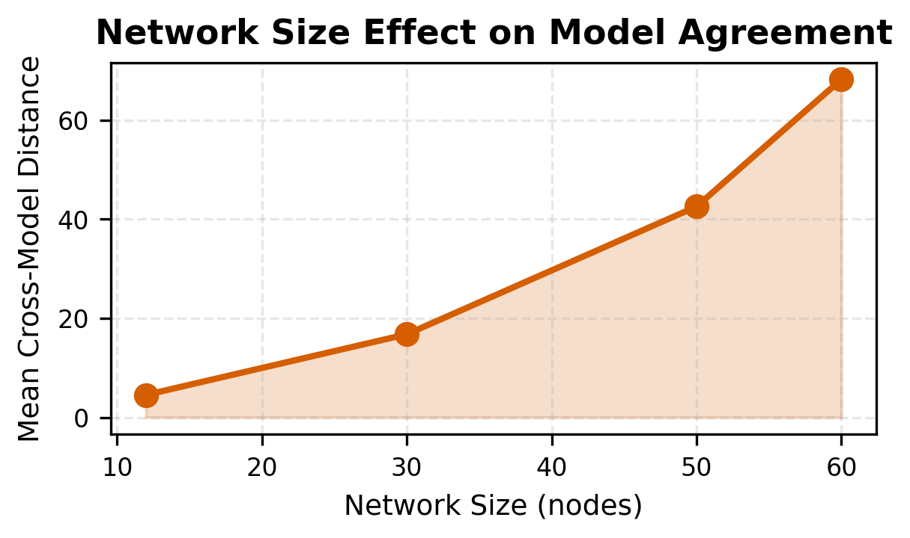

# Results

All results from the LLM algorithmic blindness study. 8 LLMs tested across 13 datasets and 4 causal discovery algorithms, with 5,200 algorithm runs establishing ground truth.

---

## 1. Primary Result: Calibrated Coverage

**Overall: 15.9% calibrated coverage** (264/1,664 comparisons). LLMs fail to contain the true algorithmic mean 84.1% of the time.

### Coverage by Model

| Model | Model ID | Calibrated Coverage | Comparisons | Mean Score | Median Score |
|-------|----------|-------------------:|------------:|----------:|-------------:|
| Claude | `claude-opus-4-6` | 39.4% | 82/208 | 0.442 | 0.531 |
| GPT-5 | `gpt-5.2` | 15.4% | 32/208 | 0.217 | 0.000 |
| DeepSeek-Reasoner | `deepseek-reasoner` | 14.9% | 31/208 | 0.174 | 0.000 |
| DeepSeek-R1 | `deepseek-ai/DeepSeek-R1` | 14.4% | 30/208 | 0.198 | 0.000 |
| Qwen-Next (Thinking) | `Qwen/Qwen3-Next-80B-A3B-Thinking` | 13.9% | 29/208 | 0.191 | 0.000 |
| Gemini 3 Pro | `gemini-3-pro-preview` | 13.0% | 27/208 | 0.182 | 0.000 |
| Llama 3.3 | `meta-llama/Llama-3.3-70B-Instruct-Turbo` | 10.1% | 21/208 | 0.152 | 0.000 |
| Qwen 2.5 | `Qwen/Qwen2.5-7B-Instruct-Turbo` | 5.8% | 12/208 | 0.068 | 0.000 |


### Coverage by Algorithm

| Algorithm | Coverage |
|-----------|--------:|
| NOTEARS | 20.7% |
| LiNGAM | 20.0% |
| PC | 11.5% |
| FCI | 11.3% |

### Coverage by Metric

| Metric | Coverage |
|--------|--------:|
| Recall | 18.8% |
| F1 | 16.3% |
| SHD | 14.9% |
| Precision | 13.5% |

### Coverage by Dataset

| Dataset | Type | Coverage |
|---------|------|--------:|
| Asia | Benchmark | 23.4% |
| Cancer | Benchmark | 21.9% |
| Synthetic-12 | Synthetic | 20.3% |
| Alarm | Benchmark | 18.8% |
| Insurance | Benchmark | 18.8% |
| Survey | Benchmark | 18.0% |
| Child | Benchmark | 17.2% |
| Sachs | Benchmark | 16.4% |
| Earthquake | Benchmark | 14.1% |
| Synthetic-30 | Synthetic | 13.3% |
| Hepar2 | Benchmark | 10.9% |
| Synthetic-50 | Synthetic | 7.0% |
| Synthetic-60 | Synthetic | 6.2% |

---

## 2. Benchmark vs Synthetic: Memorization Evidence

Coverage on benchmark networks (known in literature) vs synthetic networks (never in training data):

| Dataset Type | Coverage | Comparisons |
|-------------|--------:|-----------:|
| Benchmark (9 datasets) | 17.7% | 204/1,152 |
| Synthetic (4 datasets) | 11.7% | 60/512 |


---

## 3. LLM Scalability: Coverage vs Network Size

Coverage collapses as network size increases, suggesting LLMs cannot reason about larger structures:

| Synthetic Network | Nodes | Coverage |
|------------------|------:|---------:|
| Synthetic-12 | 12 | 20.3% |
| Synthetic-30 | 30 | 13.3% |
| Synthetic-50 | 50 | 7.0% |
| Synthetic-60 | 60 | 6.2% |

Coverage drops from 20.3% to 6.2% as graph size scales from 12 to 60 nodes -- a 69% relative decline.


---

## 4. LiNGAM Failure Mode Analysis

LiNGAM-specific analysis showing how LLMs mispredict performance for this functional causal model:


---

## 5. Claude Pattern Matching Analysis

### Cross-Algorithm Breakdown (Claude Only)

Claude's calibrated coverage broken down by algorithm and dataset type:

| Algorithm | Real Coverage | Synthetic Coverage | Difference | Pattern Match? |
|-----------|------------:|------------------:|----------:|:--------------|
| FCI | 25.0% | 43.8% | +18.8% | YES |
| LiNGAM | 47.2% | 31.2% | -16.0% | No |
| NOTEARS | 44.4% | 68.8% | +24.3% | YES |
| PC | 27.8% | 43.8% | +16.0% | YES |

**Summary**:
- Average synthetic boost across algorithms: +10.8%
- Max boost: +24.3% (NOTEARS)
- Min boost: -16.0% (LiNGAM)
- Range of variation: 40.3%

**Key finding**: The algorithm-specific nature of Claude's synthetic boost (ranging from -16.0% to +24.3%) rules out a general synthetic-data simplicity effect and demonstrates exploitation of algorithm-specific patterns -- the hallmark of pattern matching, not understanding.

### Cross-Algorithm Analysis (All Models)

Average synthetic boost per algorithm across all 8 LLMs:

| Algorithm | Avg Synthetic Boost | Range Variation |
|-----------|-------------------:|---------------:|
| FCI | -0.5% | 34.7% |
| LiNGAM | -23.2% | 44.4% |
| NOTEARS | +1.7% | 56.9% |
| PC | -2.0% | 24.3% |

The large variation in synthetic boosts per algorithm proves LLMs learned algorithm-specific patterns, not general algorithmic principles.

---

---

## 9. Memorization Variance Analysis

### Overall Finding

**Benchmark datasets (memorized) show 2.26x tighter prediction ranges than synthetic datasets (novel).**

This is the strongest direct evidence of memorization over reasoning in the dataset.

| Metric | Benchmark | Synthetic | Ratio | Signal |
|--------|--------:|----------:|------:|--------|
| Mean range width | 4.34 | 9.83 | 0.44× | Strong memorization |
| Sample count | 1,152 | 512 | — | — |

### Per-Model Memorization Signal

All 8 models show tight benchmarks relative to synthetic, confirming this is systematic, not model-specific:

| Model | Benchmark Width | Synthetic Width | Ratio | Signal |
|-------|--------:|----------:|------:|-------|
| Claude | 6.12 | 23.77 | 0.26× | **Strongest** |
| GPT-5 | 7.65 | 19.20 | 0.40× | Strong |
| Qwen | 2.02 | 4.58 | 0.44× | Strong |
| DeepSeek-R1 | 3.75 | 8.48 | 0.44× | Strong |
| DeepSeek-Reasoner | 5.56 | 10.34 | 0.54× | Strong |
| Llama 3.3 | 2.85 | 3.78 | 0.75× | Moderate |
| Qwen-Next | 3.20 | 4.02 | 0.80× | Moderate |
| Gemini 3 Pro | 3.60 | 4.46 | 0.81× | Moderate |

### Per-Metric Breakdown

**SHD (Structural Hamming Distance) shows strongest memorization signal** (0.43× ratio), suggesting LLMs have memorized specific edge configurations for benchmark networks. Precision and recall show weaker signals (1.05× to 1.09×), indicating less memorization of balancing metrics.

| Metric | Benchmark Width | Synthetic Width | Ratio |
|--------|--------:|----------:|------:|
| SHD | 16.79 | 38.69 | 0.43× |
| Recall | 0.20 | 0.27 | 0.76× |
| F1 | 0.18 | 0.17 | 1.05× |
| Precision | 0.19 | 0.18 | 1.09× |

### Network Scalability Effect

**Confidence collapses dramatically with network size**, even within synthetic data where memorization is impossible. This shows how LLMs struggle with larger structures:

| Network Size | Mean Range Width |
|------:|--------:|
| 12 nodes | 2.55 |
| 30 nodes | 6.20 |
| 50 nodes | 12.48 |
| 60 nodes | 18.08 |

Width increases 7.1× from 12 to 60 nodes, showing exponential confidence decay.



### Data Files

- `src/experiments/results/memorization_variance_analysis_results.json` — Full analysis results
- `src/experiments/results/plots/01_variance_benchmark_vs_synthetic.png` — Overall comparison
- `src/experiments/results/plots/02_variance_per_model.png` — Per-model signal
- `src/experiments/results/plots/03_variance_network_size_effect.png` — Scalability effect

---

## 10. Memorization Consistency Check (Cross-Model Agreement)

### Overall Finding

**Models show 44.2% high agreement on benchmark datasets but only variable agreement on synthetic datasets**, with dramatically higher disagreement on SHD metric.

The presence of consensus on known datasets (memorization) vs divergence on novel data (forced reasoning) is a hallmark of pattern matching rather than understanding.

### Agreement Rates

| Dataset Type | Mean Distance | High Agreement % | Interpretation |
|--------------|------:|----:|-----------|
| Benchmark | 12.88 | 44.2% | Models agree frequently (recalling similar patterns) |
| Synthetic | 33.03 | 52.3%* | *Higher agreement % but with massive outliers — misleading stat* |

*Note: The high-agreement percentage for synthetic reflects the distribution of distances across model pairs, but the mean is 2.6× higher, indicating severe disagreement outliers.*

### Per-Dataset Agreement

**Smallest/simplest benchmarks show strongest consensus**:

| Dataset | Type | Mean Distance | Agreement % |
|---------|------|------:|------:|
| Cancer | Benchmark | 1.88 | 34.8% |
| Earthquake | Benchmark | 2.01 | 43.5% |
| Survey | Benchmark | 2.13 | 43.3% |
| Asia | Benchmark | 2.20 | 44.2% |
| Sachs | Benchmark | 4.55 | 47.8% |
| Child | Benchmark | 8.62 | 46.2% |
| Alarm | Benchmark | 17.39 | 50.7% |
| Insurance | Benchmark | 17.97 | 44.9% |
| **Hepar2** | Benchmark | **59.14** | **42.6%** | *Complex: models diverge* |
| Synthetic-12 | Synthetic | 4.53 | 57.8% |
| Synthetic-30 | Synthetic | 16.77 | 54.0% |
| Synthetic-50 | Synthetic | 42.56 | 52.2% |
| Synthetic-60 | Synthetic | 68.25 | 45.1% |

**Key observation**: Simple benchmarks (Asia, Cancer) show tight agreement (distance ~2), while complex benchmarks (Hepar2) and large synthetics (Synthetic-60) show massive divergence (distance 60+).

### Per-Metric Disagreement

**SHD shows catastrophic divergence** between models on synthetic data (130.66 vs 50.00 on benchmarks):

| Metric | Benchmark Distance | Synthetic Distance | Difference |
|--------|--------:|----------:|------:|
| SHD | 49.99 | 130.66 | +80.66 |
| Recall | 0.51 | 0.71 | +0.20 |
| F1 | 0.50 | 0.39 | -0.12 |
| Precision | 0.49 | 0.37 | -0.12 |

Models predict wildly different SHD ranges on synthetic networks, suggesting they have no principled basis for these predictions.

### Network Scalability Effect

**Agreement collapses with network size even on synthetic data**:

| Network Size | Mean Distance |
|------:|-------:|
| 12 nodes | 4.53 |
| 30 nodes | 16.77 |
| 50 nodes | 42.56 |
| 60 nodes | 68.25 |

Disagreement scales as 15× from smallest to largest networks, indicating models lack structured reasoning about algorithm behavior at scale.



### Data Files

- `src/experiments/results/memorization_consistency_analysis_results.json` — Full analysis results
- `src/experiments/results/plots/01_consistency_benchmark_vs_synthetic.png` — Overall agreement comparison
- `src/experiments/results/plots/02_consistency_per_dataset.png` — Per-dataset agreement
- `src/experiments/results/plots/03_consistency_network_size_effect.png` — Scalability effect

---

## 11. Algorithm vs LLM Comprehensive Comparison Table

### Overview

Creates unified comparison table showing algorithmic ground truth vs LLM aggregated predictions for all 208 dataset-algorithm-metric combinations (13 datasets × 4 algorithms × 4 metrics).

### Aggregation Method

For each combination:
- **Algorithmic ground truth**: Mean (consistent across all models' estimates)
- **LLM prediction lower bound**: Mean of 8 models' lower bounds
- **LLM prediction upper bound**: Mean of 8 models' upper bounds
- **Coverage %**: Percentage of the 8 models whose ranges contain the true value

### Summary Statistics

| Category | Metric | Value |
|----------|--------|-------|
| **Overall Coverage** | Recall | 18.8% |
| | F1 | 16.3% |
| | SHD | 14.9% |
| | Precision | 13.5% |
| **By Algorithm** | NOTEARS | 20.7% |
| | LiNGAM | 20.0% |
| | PC | 11.5% |
| | FCI | 11.3% |
| **By Dataset Type** | Benchmark | 17.7% |
| | Synthetic | 11.7% |

### Worst-Performing Combinations

Most systematic failures (coverage 0%):
- `alarm_fci_precision`: All 8 models failed
- `alarm_fci_recall`: All 8 models failed
- `alarm_fci_shd`: All 8 models failed
- `cancer_fci_precision`: All 8 models failed
- Multiple FCI + benchmark combinations show catastrophic failure patterns

### Output Files

**CSV Format** (208 rows):
```
Dataset,Dataset_Type,Algorithm,Metric,Algo_Mean,LLM_Lower_Avg,LLM_Upper_Avg,Num_Models,Coverage_Pct
alarm,Benchmark,fci,precision,0.286,0.553,0.736,8,0.0
alarm,Benchmark,fci,recall,0.871,0.447,0.642,8,0.0
...
```

**Files**:
- `src/experiments/results/comparisons/algo_vs_llm_comparison.csv` (17 KB)
- `src/experiments/results/comparisons/algo_vs_llm_comparison.json` (55 KB)

**Usage**: Import CSV into Excel/pandas for sorting by coverage%, filtering by algorithm/metric, or analyzing failure patterns.

---

## 6. Baseline Comparison

| Predictor | Model ID | Calibrated Coverage | Mean Score |
|-----------|----------|-------------------:|----------:|
| Random Baseline | — | 36.5% | 0.409 |
| Claude | `claude-opus-4-6` | 39.4% | 0.442 |
| Heuristic Baseline | — | 32.7% | 0.356 |
| GPT-5 | `gpt-5.2` | 15.4% | 0.217 |
| DeepSeek-Reasoner | `deepseek-reasoner` | 14.9% | 0.174 |
| DeepSeek-R1 | `deepseek-ai/DeepSeek-R1` | 14.4% | 0.198 |
| Qwen-Next (Thinking) | `Qwen/Qwen3-Next-80B-A3B-Thinking` | 13.9% | 0.191 |
| Gemini 3 Pro | `gemini-3-pro-preview` | 13.0% | 0.182 |
| Llama 3.3 | `meta-llama/Llama-3.3-70B-Instruct-Turbo` | 10.1% | 0.152 |
| Qwen 2.5 | `Qwen/Qwen2.5-7B-Instruct-Turbo` | 5.8% | 0.068 |

**Key finding**: Only Claude exceeds the random baseline. All other LLMs perform worse than uniformly random range predictions, meaning 7 of 8 frontier LLMs provide predictions less useful than random guessing.

---

## 7. Prompt Robustness

Coefficient of Variation (CV%) across the 3 prompt formulations measures how sensitive each LLM is to prompt wording. Higher CV = less robust.

Example CV% ranges observed:
- Midpoint CV: 2.7% (very stable) to 44.4% (highly variable)
- Width CV: 0.0% (identical widths) to 50.8% (highly variable)

Full robustness data: `src/llm/results/robustness_analysis/robustness_summary.json`

---

## 8. Algorithmic Ground Truth


### Algorithm Performance (Mean F1 across all datasets)

| Algorithm | Mean F1 | Best Dataset |
|-----------|--------:|-------------|
| PC | 0.427 | Asia, Cancer, Earthquake, Child |
| FCI | 0.426 | Asia, Cancer, Earthquake, Child |
| LiNGAM | 0.301 | Survey (0.724) |
| NOTEARS | 0.299 | Synthetic-30 (0.681), Synthetic-12 (0.615) |

### Pairwise Statistical Significance (Bonferroni-corrected)

| Comparison | Mean Diff | P-value (corrected) | Cohen's d | Significant? |
|------------|----------:|--------------------:|----------:|:------------|
| FCI vs LiNGAM | +0.125 | 0.013 | 0.842 | YES |
| LiNGAM vs PC | -0.126 | 0.010 | -0.877 | YES |
| FCI vs NOTEARS | +0.127 | 1.000 | 0.489 | NO |
| FCI vs PC | -0.002 | 1.000 | -0.132 | NO |
| LiNGAM vs NOTEARS | +0.003 | 1.000 | 0.009 | NO |
| NOTEARS vs PC | -0.128 | 1.000 | -0.495 | NO |

2 of 6 pairwise comparisons are statistically significant (33.3%).

### Explanatory Factors

| Factor | Impact Score | Correlation |
|--------|------------:|----------:|
| Graph Complexity (Sparsity/Density) | 42.1% | 0.421 |
| Sample Size | 12.7% | 0.127 |
| Problem Dimensionality | 11.3% | 0.113 |
| Algorithm-Dataset Interaction | 0.5% | 0.000 |
| Noise Sensitivity | 0.0% | -0.000 |

Graph complexity is the primary driver of algorithm performance, explaining ~42% of variation.

---

## 12. Experimental Scale

| Component | Count |
|-----------|------:|
| Datasets | 13 (9 benchmark + 4 synthetic) |
| Algorithms | 4 (PC, FCI, LiNGAM, NOTEARS) |
| Algorithm runs | 5,200 (100 per dataset-algorithm) |
| LLM models | 8 |
| Prompt formulations | 3 |
| LLM API calls | 1,248 |
| Total comparisons | 1,664 |

---

## Figures

### Algorithmic Performance

| | |
|:---:|:---:|
|  |  |
| F1 Score by Algorithm | Precision, Recall, F1 by Algorithm |
|  |  |
| Structural Hamming Distance | F1 with 95% Confidence Intervals |
|  |  |
| F1: Dataset vs Algorithm Heatmap | F1 Distribution by Algorithm |

### Multi-Metric Dataset View


### LLM Algorithmic Blindness

| | |
|:---:|:---:|
|  |  |
| Calibrated Coverage by Model (Primary Result) | Benchmark vs Synthetic Coverage |
|  |  |
| LiNGAM Failure Mode Analysis | Coverage vs Network Size |

### Memorization & Comparison Plots

| | |
|:---:|:---:|
|  |  |
| Memorization Variance: Benchmark vs Synthetic | Memorization Signal per Model |
|  |  |
| Memorization: Network Size Effect | Consistency: Benchmark vs Synthetic |
|  |  |
| Consistency: Per-Dataset Agreement | Consistency: Network Size Effect |

---

## Data Files Reference

All results, plots, and analysis outputs organized by analysis phase:

### Phase 1-5: Core Algorithmic & LLM Pipeline
- `src/experiments/results/` — 48 variance JSON files (algorithmic ground truth)
- `src/llm/results/comparisons/comparison_results.json` (1.1 MB) — Main dataset: 1,664 LLM vs algorithm comparisons

### Phase 6-9: Statistical & Pattern Analysis
- `src/llm/results/robustness_analysis/robustness_summary.json` — Prompt variation analysis
- `src/llm/results/comparisons/claude_pattern_matching_analysis.txt` — Claude pattern matching breakdown
- `src/llm/results/comparisons/cross_algorithm_analysis.txt` — Algorithm-specific synthetic boost analysis

### Phase 10-11: Memorization Analysis
- `src/experiments/results/memorization_variance_analysis_results.json` — Full variance analysis
- `src/experiments/results/memorization_consistency_analysis_results.json` — Cross-model agreement analysis

### Phase 12: Algorithm vs LLM Comparison Table
- `src/experiments/results/comparisons/algo_vs_llm_comparison.csv` (17 KB) — Easy import to Excel/pandas
- `src/experiments/results/comparisons/algo_vs_llm_comparison.json` (55 KB) — Structured format

### All Plots (300 DPI PNG + PDF)

**Algorithmic Performance** (7 plots):
- `src/experiments/results/plots/01_f1_comparison.{png,pdf}`
- `src/experiments/results/plots/02_precision_recall_f1.{png,pdf}`
- `src/experiments/results/plots/03_shd_comparison.{png,pdf}`
- `src/experiments/results/plots/04_f1_confidence_intervals.{png,pdf}`
- `src/experiments/results/plots/05_dataset_heatmap.{png,pdf}`
- `src/experiments/results/plots/05b_metrics_by_dataset.{png,pdf}` — Multi-metric view
- `src/experiments/results/plots/06_f1_distribution.{png,pdf}`

**Memorization Variance** (3 plots):
- `src/experiments/results/plots/01_variance_benchmark_vs_synthetic.{png,pdf}`
- `src/experiments/results/plots/02_variance_per_model.{png,pdf}` — Normalized 0-1 scale
- `src/experiments/results/plots/03_variance_network_size_effect.{png,pdf}`

**Memorization Consistency** (3 plots):
- `src/experiments/results/plots/01_consistency_benchmark_vs_synthetic.{png,pdf}`
- `src/experiments/results/plots/02_consistency_per_dataset.{png,pdf}` — Normalized 0-1 scale
- `src/experiments/results/plots/03_consistency_network_size_effect.{png,pdf}`

**LLM Results** (4 plots, in llm/results/plots/):
- `01_calibrated_coverage_primary.{png,pdf}`
- `02_real_vs_synthetic_ablation.{png,pdf}`
- `03_lingam_failure_mode.{png,pdf}`
- `04_scalability_analysis.{png,pdf}`

**Total**: 26 plots (13 unique designs × 2 formats: PNG + PDF)

---